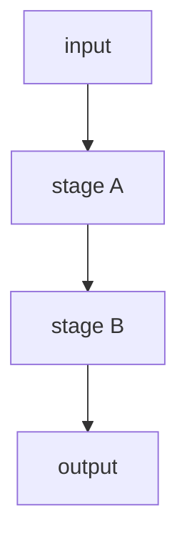

# Algorithm_Template

> Before filling this template, review [[llmzone/shared/SKILL]] and [[llmzone/shared/Pre_Edit_Checklist]].

<!-- AUTOGEN:status START -->
<!-- AUTOGEN:status END -->

One sentence: what problem this algorithm solves.

## Implementation refs

- `path/to/header.h`
- `path/to/source.cpp`

## Pipeline

## Inputs and outputs

- **Inputs**: types, where they come from, invariants assumed
- **Outputs**: types, who consumes them

## Stages

### Step A — <name>

One-line summary.

Deep-dive (replace with real link once the step note exists): `[[<AlgorithmName>/StepA_<StepName>]]`

Configs touched:
- `field.name = value` (default)

### Step B — <name>

(repeat per stage)

## Querying / Usage

How callers invoke this. Cost per call: `O(...)`.

## Coupling and known gaps

- Implicit dependencies on upstream state
- Magic numbers and where they live
- Dead branches in the current code path

## Complexity summary

Construction: `O(...)` where ...
Per query: `O(...)` where ...

## Alternatives in the codebase

Other implementations of the same interface, why they're not the default.

## Open Questions

- Pipeline-wide questions that don't belong to a single step.

## Related

<!-- AUTOGEN:related START -->
<!-- AUTOGEN:related END -->
